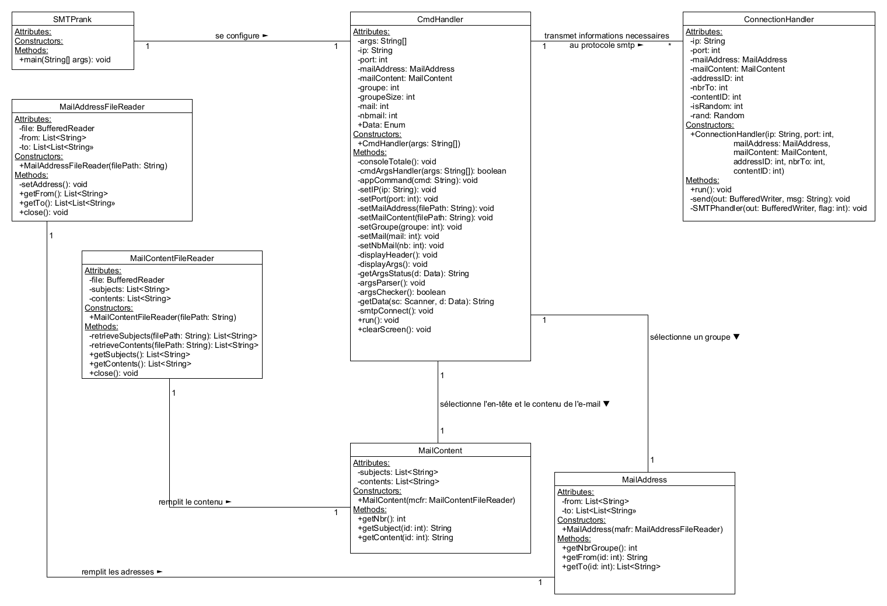

# SMTPrank

Ce programme est une application en ligne de commande permettant d'envoyer des courriels SMTP à plusieurs destinataires à partir d'une liste d'adresses électroniques et de contenus prédéfinis.

## Description

Ce projet vise à simplifier l'envoi de courriels en masse (spams) en utilisant le protocole SMTP. Il permet de spécifier des adresses électroniques de destinataires ainsi que le contenu des courriels à envoyer, le tout géré via des paramètres en ligne de commande ou une interface console.

## Comment installer le programme

Il est recommandé d'utiliser la compilation avec Maven pour des raisons de simplicité et d'efficacité lors du déploiement.

### Compilation standard

Commencer par cloner ce dépôt gitHub : 
```sh 
git clone https://github.com/Fleury-Romain/DAI-Lab04-SMTP 
```

Compiler ensuite le code présent dans ```DAI-Lab04-SMTP``` dans un dossier de destination de compilation, ici ```bin/```

```shell
javac -d bin/ code/src/main/java/ch/heig/dai/lab/SMTP/*.java
```

Exécuter la classe principale ```MainTest``` pour lancer le programme (sans argument en console)

```shell
java bin/ch.heig.dai.lab.SMTP.SMTPrank
```

#### Script complet de déploiement standard

```shell
git clone https://github.com/Fleury-Romain/DAI-Lab04-SMTP 

cd DAI-Lab04-SMTP
mkdir bin

javac -d bin/ code/src/main/java/ch/heig/dai/lab/SMTP/*.java
java bin/ch.heig.dai.lab.SMTP.SMTPrank
```

### Compilation avec Maven

Cloner le dépôt GitHub comme vu plus haut
```sh 
git clone https://github.com/Fleury-Romain/DAI-Lab04-SMTP 
```
Aller dans le dossier ```code``` qui contient le fichier pom.xml pour Maven

```shell
cd DAI-Lab04-SMTP/code/
```

Compiler les fichiers java avec Maven

```shell
mvn clean
mvn package
```
Lancer le fichier ```SMTPrank.jar``` se trouvant dans ```target/```

```shell
java target/SMTPrank.jar
```

#### Script complet de déploiement avec Maven
```shell
git clone https://github.com/Fleury-Romain/DAI-Lab04-SMTP
cd DAI-Lab04-SMTP/code/ 
mvn clean 
mvn package 
java -jar target/SMTPrank-1.0.jar

```

## Structure du Code

Le code est organisé en plusieurs classes offrant les fonctionnalités suivantes :

- `SMTPrank`: Initialise le programme en mode console ou lance le lance directement en fonction des arguments fournis.
- `CmdHandler`: Gère les commandes de l'utilisateur en mode console, permettant de configurer les adresses, les contenus et autres paramètres.
- `ConnectionHandler`: Établit une connexion SMTP avec le serveur pour l'envoi des courriels.
- `MailAddress` et `MailContent`: Gèrent respectivement les adresses e-mail et les contenus des e-mails.
- `MailAddressFileReader` et `MailContentFileReader`: Lisent les fichiers pour extraire les adresses et les contenus à partir de formats spécifiques.

Un schéma UML résumant les classes crées et leurs interactions est donné ci-dessous.



## Utilisation

### Exécution du programme avec arguments

L'exécution avec des arguments (longs et courts) en ligne de commande permet de configurer directement les adresses e-mail, les contenus et autres paramètres pour l'envoi des courriels. Les arguments disponibles sont les suivants :
- `--ip [adresse]` ou `-i [adresse]`: Définit l'adresse IP pour la connexion SMTP.
- `--port [port]` ou `-p [port]`: Définit le port pour la connexion SMTP.
- `--mailaddress [fichier]` ou `-ma [fichier]`: Spécifie le fichier contenant les adresses e-mail.
- `--mailcontent [fichier]` ou `-mc [fichier]`: Spécifie le fichier contenant le contenu des e-mails.
- `--groupe [groupe]` ou `-g [groupe]`: Définit le groupe d'adresses à utiliser.
- `--mail [mail]` ou `-m [mail]`: Définit l'e-mail à envoyer.
- `--size [taille]` ou `-s [taille]`: Définit la taille du groupe d'adresses.
- `--nbmail [nombre]` ou `-nm [nombre]`: Définit le nombre d'e-mails à envoyer.
 
### Exécution du programme en console

Lorsque le programme est lancé en mode console (`CmdHandler`), les commandes suivantes sont disponibles :
- `set ip [adresse]`: Définit l'adresse IP pour la connexion SMTP.
- `set port [port]`: Définit le port pour la connexion SMTP.
- `set mailaddress [fichier]`: Spécifie le fichier contenant les adresses e-mail.
- `set mailcontent [fichier]`: Spécifie le fichier contenant le contenu des e-mails.
- `set groupe [groupe]`: Définit le groupe d'adresses à utiliser.
- `set mail [mail]`: Définit l'e-mail à envoyer.
- `set size [taille]`: Définit la taille du groupe d'adresses.
- `get groupe [ID]`: Affiche les adresses du groupe spécifié.
- `get mail [ID]`: Affiche le contenu de l'e-mail spécifié.
- `send`: Envoie les courriels en utilisant la configuration actuelle.
- `nbmail [nombre]`: Définit le nombre d'e-mails à envoyer.

## Problèmes Possibles

Les utilisateurs pourraient rencontrer les problèmes suivants :
- **Format des Fichiers**: Les fichiers d'adresses e-mail et de contenu d'e-mails doivent respecter un format spécifique pour être lus correctement.
- **Erreurs de Paramètres**: Des erreurs peuvent survenir si les paramètres passés en ligne de commande ne sont pas corrects ou ne sont pas dans la plage attendue. Une gestion minimale des erreurs a néanmoins été implémentée.